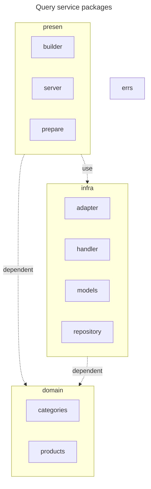

```mermaid
---
title: Query service packages
---
%% This Mermaid diagram represents the dependency relationships between packages.
flowchart TB
    subgraph "presen"
        A-1[builder]
        A-2[server]
        A-3[prepare]
    end
    subgraph "domain"
        B-1[categories]
        B-2[products]
    end
    subgraph "infra"
        C-1[adapter]
        C-2[handler]
        C-3[models]
        C-4[repository]
    end
    D[errs]
    presen-.dependent.->domain;
    presen-.use.->infra;
    infra-.dependent.->domain;
```